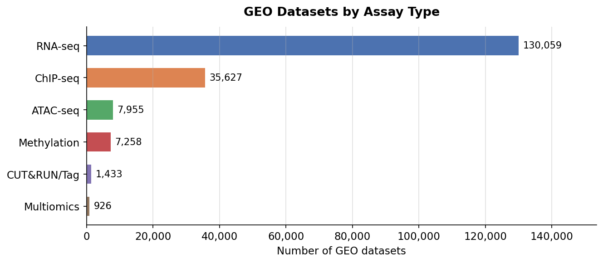
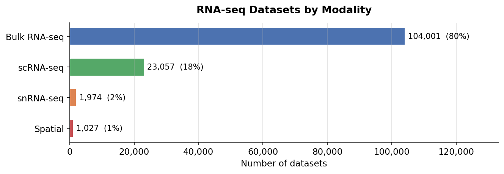
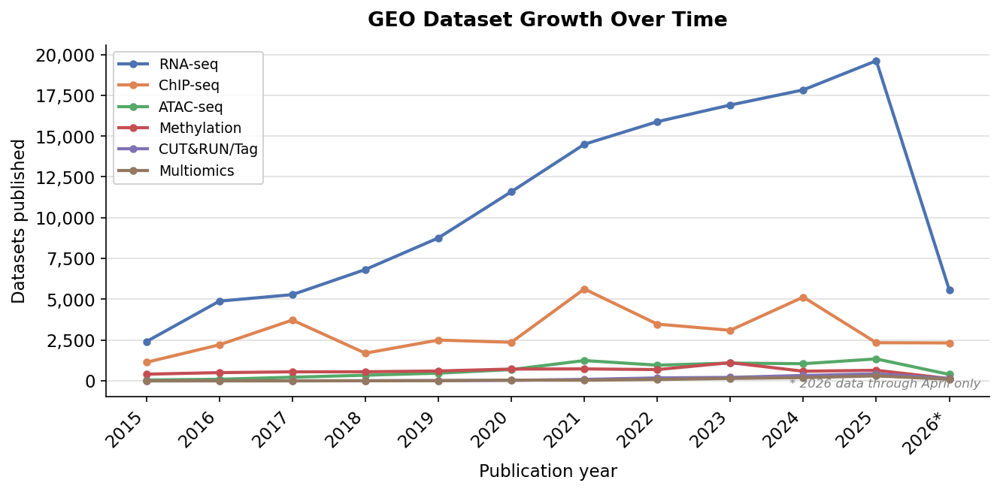
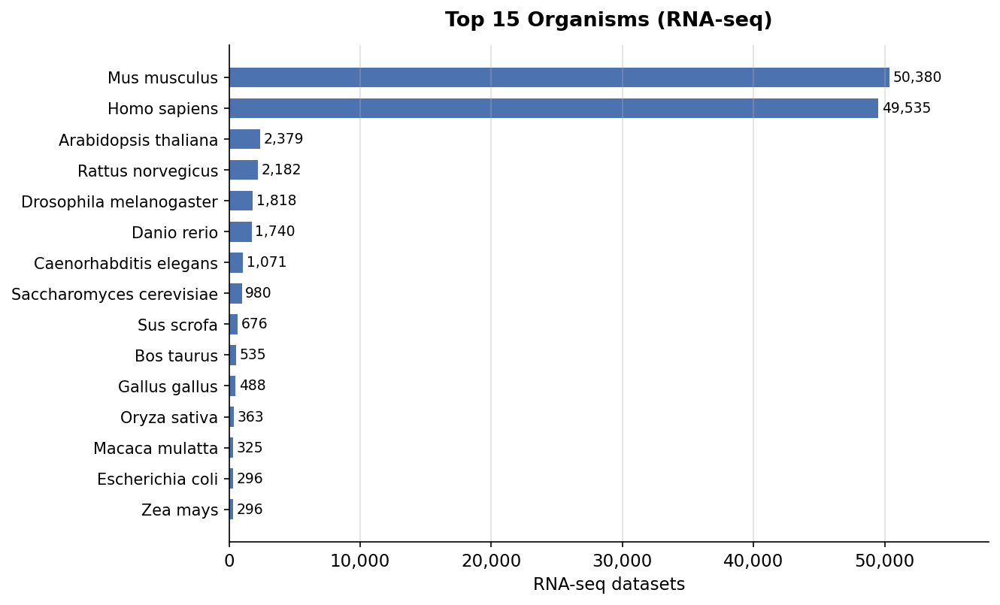
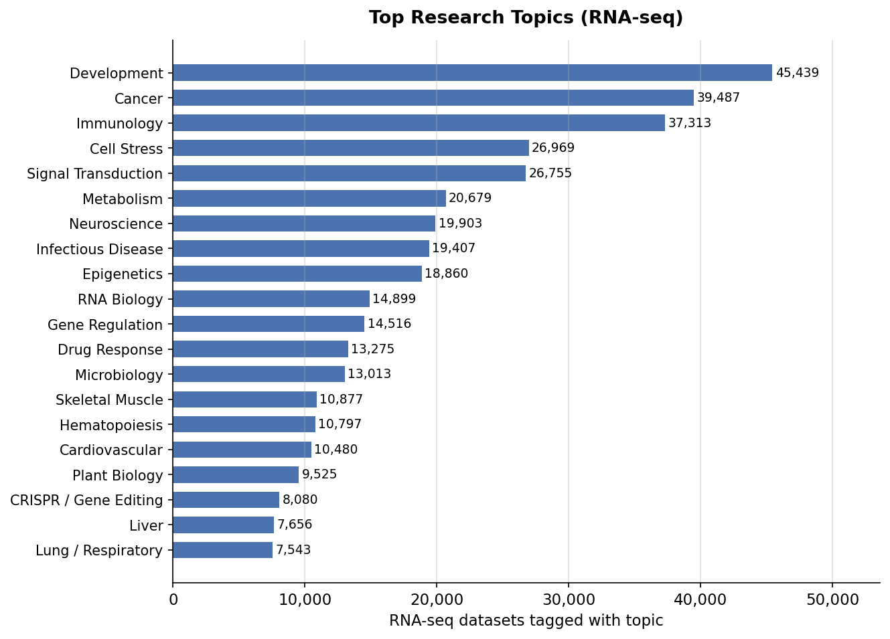

# GEO Multi-omics Wiki

A periodically-updated, LLM-queryable index of genomics datasets from [GEO (Gene Expression Omnibus)](https://www.ncbi.nlm.nih.gov/geo/). Covers 170,000+ datasets across RNA-seq, ChIP-seq, ATAC-seq, methylation, and multiomics from 2015 to present, organized by organism, modality, research topic, and available file formats.

Inspired by [Karpathy's LLM wiki pattern](https://gist.github.com/karpathy/442a6bf555914893e9891c11519de94f).

## What this is

Finding relevant sequencing data on GEO is hard. The search interface is limited, metadata is inconsistent, and it's impossible to quickly answer questions like:

- *"What mouse kidney snRNA-seq datasets have processed count matrices available?"*
- *"How many human cancer ChIP-seq datasets targeting H3K27ac were published since 2022?"*
- *"Is there spatial transcriptomics data for zebrafish development?"*
- *"Which CITE-seq datasets profile human PBMCs with both RNA and protein?"*

This project solves that by building a structured, grep-friendly index designed for LLM querying. Give it to an LLM as context and it can answer dataset discovery questions in seconds.

## Data coverage



| Metric | Value |
|---|---|
| Date range | 2015-Q1 through April 2026 |
| **RNA-seq datasets** | **~130,000** |
| — Bulk RNA-seq | ~104,000 |
| — Single-cell (scRNA-seq) | ~23,000 |
| — Single-nucleus (snRNA-seq) | ~2,000 |
| — Spatial transcriptomics | ~1,000 |
| **ChIP-seq / CUT&RUN / CUT&Tag** | **~45,000** |
| **ATAC-seq** | **~8,000** |
| **Methylation** (WGBS, RRBS, arrays, …) | **~7,300** |
| **Multiomics** (CITE-seq, 10x Multiome, …) | **~930** |
| Organisms | 155 species |
| Research topics | 28 categories |
| FTP index (supplementary files) | 100% covered |




## Quick start

### Option 1: Query the wiki directly (no setup)

The wiki and search index are checked into this repo. Clone and grep:

```bash
git clone https://github.com/bendevlin18/GEO_llm
cd GEO_llm

# Find mouse snRNA-seq datasets related to neuroscience
grep "single-nucleus.*Mus musculus.*neuroscience" wiki/search_index_rnaseq.txt

# Find human spatial transcriptomics with H5AD files
grep "spatial.*Homo sapiens" wiki/search_index_rnaseq.txt | grep "\.h5ad"

# Find human ChIP-seq datasets related to cancer
grep "chip_seq.*Homo sapiens.*cancer" wiki/search_index_chipseq.txt

# Find ATAC-seq datasets in mouse
grep "Mus musculus" wiki/search_index_atacseq.txt

# Browse the wiki
cat wiki/organisms/mus_musculus.md
cat wiki/topics/cancer.md
cat wiki/assays/scrna_seq.md
```

### Option 2: Bootstrap the full dataset (for pipeline re-runs or programmatic access)

The classified JSON and FTP index are distributed via GitHub Releases (not in git — they're large). Download them with the bootstrap script:

```bash
git clone https://github.com/bendevlin18/GEO_llm
cd GEO_llm
conda env create -n GEO_llm python=3.11  # or any Python 3.10+
conda run -n GEO_llm python scripts/bootstrap.py
```

This fetches `rnaseq_classified.json` (103 MB) and `ftp_index.json` (46 MB) — about 30 MB compressed — from the latest [GitHub Release](https://github.com/bendevlin18/GEO_llm/releases).

After bootstrapping you can rebuild the wiki/search index locally:

```bash
conda run -n GEO_llm python scripts/build_search_index.py
conda run -n GEO_llm python scripts/generate_wiki.py
```

## Querying with an LLM

The search index is split into per-assay shard files, each designed for LLM consumption:

| File | Assay | Records |
|---|---|---|
| `wiki/search_index_rnaseq.txt` | Bulk, scRNA-seq, snRNA-seq, spatial | ~130k |
| `wiki/search_index_chipseq.txt` | ChIP-seq, ChIP-exo | ~26.6k |
| `wiki/search_index_atacseq.txt` | ATAC-seq | ~8k |
| `wiki/search_index_cut_run_tag.txt` | CUT&RUN, CUT&Tag | ~1.4k |
| `wiki/search_index_methylation.txt` | WGBS, RRBS, EM-seq, MeDIP-seq, 5hmC-seq, arrays | ~5.2k |
| `wiki/search_index_multiomics.txt` | CITE-seq, 10x Multiome, spatial multiomics | ~930 |

Each line is pipe-delimited:

```
accession|modality|organism|n_samples|files|topics|title|keywords|flags
```

The `flags` field (9th column) is `multiomics` for RNA-seq or ATAC-seq records that are also part of a multiomics study, and empty otherwise — useful for finding datasets with paired multi-modal data available.

Example:
```
GSE217775|single-cell|Mus musculus|12|GSE217775_filtered_feature_bc_matrix.h5(245MB)|neuroscience,development|Single-cell RNA-seq of mouse cortex|transcription factor neuronal identity layer cortex|
GSE100866|single-cell|Homo sapiens|12|GSE100866_CBMC_8K_13AB_10X-RNA_umi.csv.gz(14MB),...|immunology|CITE-seq: simultaneous measurement of epitopes and transcriptomes|...|multiomics
```

To use it: grep the relevant shard file for candidate lines, then pass them to an LLM for interpretation.

Example prompt pattern:
> Here are GEO RNA-seq datasets matching "mouse kidney snrna": [paste grep results]
> Which of these are most likely to have processed count matrices suitable for re-analysis?

## Repository structure

```
GEO_llm/
├── wiki/                        # LLM-queryable output (checked in)
│   ├── search_index_rnaseq.txt      # RNA-seq index (~130k records)
│   ├── search_index_chipseq.txt     # ChIP-seq index (~26.6k records)
│   ├── search_index_atacseq.txt     # ATAC-seq index (~8k records)
│   ├── search_index_cut_run_tag.txt # CUT&RUN / CUT&Tag index (~1.4k records)
│   ├── search_index_methylation.txt # Methylation index (~5.2k records)
│   ├── search_index_multiomics.txt  # Multiomics index (~930 records)
│   ├── index.md                     # Master catalog
│   ├── organisms/                   # One page per species (~155)
│   ├── assays/                      # One page per assay type (23)
│   └── topics/                      # One page per research area (28)
│
├── assets/                      # Charts for README (checked in)
│   ├── plot_assay_overview.png
│   ├── plot_rnaseq_modalities.png
│   ├── plot_growth_over_time.png
│   ├── plot_top_organisms.png
│   └── plot_topics.png
│
├── scripts/                     # Pipeline scripts (run from project root)
│   ├── bootstrap.py                 # Download pre-built data from GitHub Releases
│   ├── geo_metadata_fetcher.py      # Fetch raw GEO metadata from NCBI API
│   ├── extract_rnaseq.py            # Filter to RNA-seq, classify modality
│   ├── extract_chipseq.py           # Filter to ChIP-seq / ATAC-seq, classify
│   ├── extract_methylation.py       # Filter to methylation datasets, classify
│   ├── extract_multiomics.py        # Filter to multiomics datasets, classify + back-annotate
│   ├── tag_topics.py                # Infer research topics from titles/summaries
│   ├── index_ftp.py                 # Index supplementary files from GEO FTP
│   ├── build_search_index.py        # Build all per-assay search index shards
│   ├── generate_wiki.py             # Generate wiki markdown pages
│   ├── generate_plots.py            # Generate README charts (requires matplotlib)
│   └── merge_and_rebuild.py         # End-to-end pipeline runner
│
├── data/                        # Raw GEO metadata snapshots (gitignored, ~315 MB)
├── rnaseq_classified.json       # Classified records (gitignored, bootstrap via script)
├── ftp_index.json               # FTP file listings (gitignored, bootstrap via script)
│
├── CLAUDE.md                    # Full technical documentation
└── plans.md                     # Project roadmap
```

## Organisms and topics




## Topic taxonomy

Datasets are tagged with one or more of 28 research topics:

| Category | Topics |
|---|---|
| Disease/Clinical | cancer, infectious_disease, cardiovascular, kidney, lung_respiratory, gut_intestine, liver, eye_vision, skin |
| Biology | development, immunology, neuroscience, metabolism, hematopoiesis, reproduction, aging, cell_cycle, cell_stress |
| Molecular | epigenetics, rna_biology, gene_regulation, signal_transduction |
| Methods | crispr_gene_editing, drug_response |
| Other | microbiology, plant_biology, fibrosis_wound, skeletal_muscle |

## Updating the data

To pull in new GEO records and rebuild:

```bash
# 1. Fetch new metadata (adjust date range as needed)
conda run -n GEO_llm python scripts/geo_metadata_fetcher.py \
    --email your@email.com \
    --start-date 2026/01/01 --end-date 2026/06/30 \
    -o data/geo_metadata_2026-Q2.json

# 2. Merge, classify, tag, and rebuild everything
conda run -n GEO_llm python scripts/merge_and_rebuild.py

# 3. Index new FTP entries (incremental — resumes if interrupted)
conda run -n GEO_llm python scripts/index_ftp.py

# 4. Rebuild search index with FTP data
conda run -n GEO_llm python scripts/build_search_index.py
```

All scripts use the NCBI E-Utilities API. An `NCBI_EMAIL` env var is required by NCBI policy; an optional `NCBI_API_KEY` raises the rate limit from 3 to 10 req/sec.

## Requirements

- Python 3.10+ (uses `X | Y` union type syntax)
- No external Python dependencies for the core pipeline — stdlib only (`urllib`, `xml`, `json`, `tarfile`)
- `matplotlib` required for `generate_plots.py`: `conda install -n GEO_llm matplotlib`
- Conda environment recommended: `conda env create -n GEO_llm python=3.11`

## Roadmap

See [`plans.md`](plans.md) for the full roadmap. Current priorities:

- **Phase 2** — Automated pipeline using the Anthropic API (unattended scrape → classify → publish)
- **Phase 2.5** — Analysis protocol pages (`wiki/protocols/`) with step-by-step guides per file format
- **Cross-assay features** — Multi-assay dataset pages linking SuperSeries that span RNA-seq + ChIP-seq + ATAC-seq from the same study
